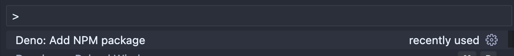

# Import NPM Modules into Deno

Deno NPM Import helps easily import npm modules and cache them. Very useful for people coming from node and often want to use a familiar package, without needing to context switch to import.

## Features

After installing the extension, a new command is available. Enter the package name you want to add and select a version

- Provides options for which available versions to import (taken from NPMs public API)
- Writes and alias using the `import_map.json` if available. Otherwise, inlines the import into your active file
- Runs `deno cache` to cache the dependency

## Requirements

This extension assumes you are working in [Deno](https://marketplace.visualstudio.com/items?itemName=denoland.vscode-deno). 

## Contribute
We appreciate your help!

To build the extension locally, clone this repository and run the following steps:

Open this folder in VS Code.
Run npm i.
Run the Launch Client launch task from the VSCode debug menu.
After making changes to the extension you can use the restart button in the VSCode debug menu, this makes a new build and reloads the client.

Note that if you already have the extension installed from the VSCode Marketplace, it will be replaced for the Launch Client instance only. So there's no need to uninstall your existing extension.

## License
[The MIT License](https://github.com/kylejreed/vscode-deno-import-npm/blob/main/LICENSE.md)